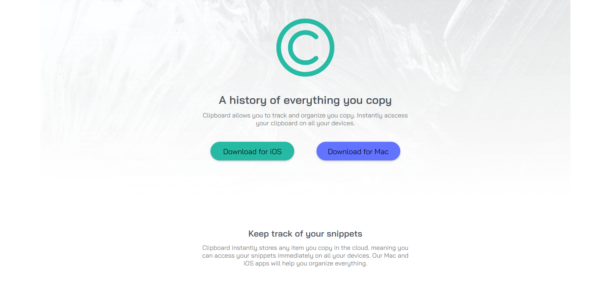
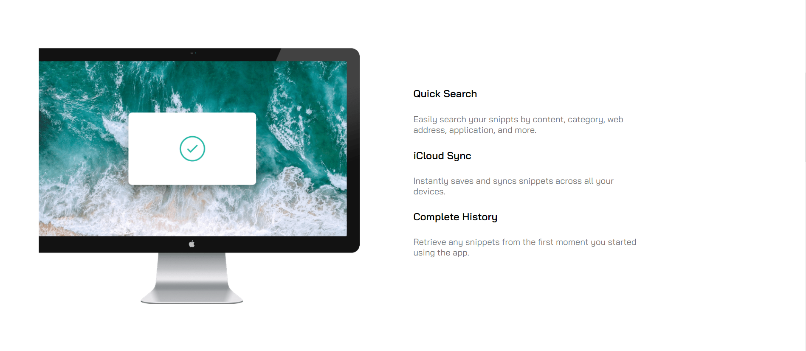
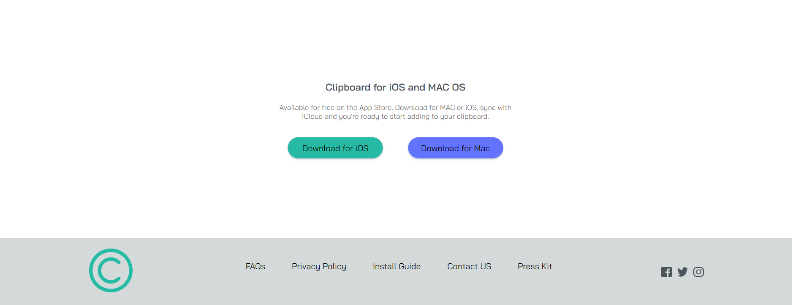

# Clipboard-landing-page
Solution For Clipboard landing page Frontend Mentor Junior HTML and CSS Challenge
## Table of contents

- [Overview](#overview)
  - [The challenge](#the-challenge)
  - [Screenshot](#screenshot)
  - [Links](#links)
- [My process](#my-process)
  - [Built with](#built-with)
  - [What I learned](#what-i-learned)
  - [Continued development](#continued-development)
  - [Useful resources](#useful-resources)
- [Author](#author)


## Overview

### The challenge

Users should be able to:

- See hover states for interactive elements.
- View the optimal layout with large screens and mobile screen ONLY.

### Screenshot





### Links

- Live Site URL: [Clipboard landing page](https://abdallahsalah003.github.io/Clipboard-landing-page/)

## My process

### Built with
ONLY WITH
- Semantic HTML5 markup
- CSS custom properties

### What I learned
I learned making variables in css and Using position.
```
    CSS
    :root {
        /*Primary*/
    
        --Strong-Cyan: hsl(171, 66%, 44%);
        --Light-Blue: hsl(233, 100%, 69%);
        
        /*Neutral*/
        
        --Dark-Grayish-Blue: hsl(210, 10%, 33%);
        --Grayish-Blue: hsl(180, 0%, 46%);
        
    }    
    .mac-section .container img {
        max-width: 100%;
        max-height: 100%;
        position: absolute;
        left: 0%; top: 0%;
    }
```

### Continued development
Why Not!
### Useful resources
- [w3schools](https://www.w3schools.com/howto/howto_css_image_overlay_title.asp)

## Author

- Website - working on it
- [@AbdallahSalah003]
